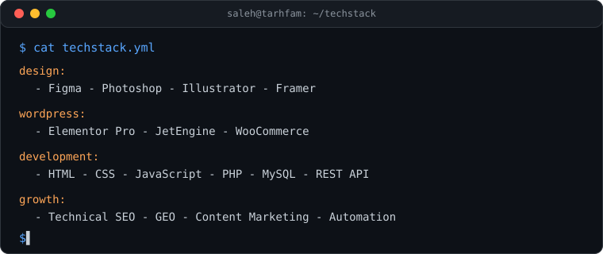
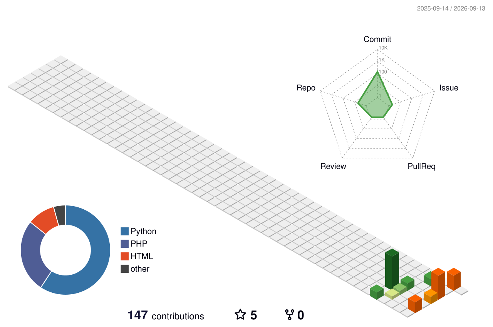

  

  <h1>Hi, I'm Saleh Sarlak 👋</h1>
  <h3>Web Designer · WordPress Developer · Founder of Tarhfam</h3>

  <!-- Social & Badges -->
  

    
    
    
    
  

  <!-- Typing Animation -->
  

 

<!-- ===== WHO AM I ===== -->
<h2>🖥️ Who Am I</h2>

  

 

<!-- ===== TECH STACK ===== -->
<h2>🛠️ Tech Stack</h2>

  

 

<!-- ===== EXPERIENCE ===== -->
<h2>💼 Experience</h2>

  

 

<!-- ===== EXPERIENCE DETAILS ===== -->

  
<b>🟡 Founder & Lead Designer — Tarhfam</b> &nbsp;2024 – Present

   
  Running Tarhfam — a digital agency focused on high-performance web design, WordPress development, SEO, and digital solutions.
  <code>WordPress</code> <code>Php</code> <code>JavaScript</code> <code>Claude</code> <code>SEO</code>

  
<b>🔵 Web Designer & WordPress Developer — Freelance</b> &nbsp;2023 – Present

   
  Designing & developing high-performance WordPress websites — focusing on UI/UX, SEO, speed, and scalable solutions for businesses.
  <code>UI/UX</code> <code>WordPress</code> <code>Php</code> <code>JavaScript</code> <code>SQL</code>

 

<!-- ===== FEATURED PROJECTS ===== -->
<h2>🎨 Featured Projects</h2>

<h3>📚 <a href="https://bookivery.ir">Bookivery</a></h3>

Custom online bookstore with city-based product availability, seller management, inventory, ordering, and delivery logic. 
<code>WordPress</code> · <code>PHP</code> · <code>JavaScript</code>

<h3>📖 <a href="https://mazesfahan.ir">Maz Isfahan</a></h3>

Professional online bookstore focused on product presentation, e-commerce functionality, and a clean user experience. 
<code>WordPress</code> · <code>PHP</code> · <code>JavaScript</code>

<h3>👟 <a href="https://patakshoes.ir">Patak Shoes</a></h3>

E-commerce website for showcasing and selling shoes and fashion products with a focused shopping experience. 
<code>WordPress</code> · <code>PHP</code> · <code>JavaScript</code>

<h3>🏥 <a href="https://amanmediran.com">Aman Med Iran</a></h3>

Medical tourism website designed to present healthcare services and build trust through a professional digital experience. 
<code>WordPress</code> · <code>PHP</code> · <code>JavaScript</code>

 

<!-- ===== GITHUB ANALYTICS ===== -->
<h2>📊 GitHub Analytics</h2>

  
    
  

 

<!-- ===== 3D CONTRIBUTION GRAPH ===== -->
<h2>🧊 3D Contribution Graph</h2>

  

 

<!-- ===== CONTRIBUTION SNAKE ===== -->
<h2>🐍 Contribution Snake</h2>

  <picture>
    <source media="(prefers-color-scheme: dark)" srcset="https://raw.githubusercontent.com/salehsarlak/salehsarlak/output/github-contribution-grid-snake-dark.svg">
    <source media="(prefers-color-scheme: light)" srcset="https://raw.githubusercontent.com/salehsarlak/salehsarlak/output/github-contribution-grid-snake.svg">
    
  </picture>

 

<!-- ===== FOOTER ===== -->

  

    📫 <strong>Reach me:</strong>
    <a href="mailto:sarlaksaleh7@gmail.com">sarlaksaleh7@gmail.com</a> ·
    <a href="https://tarhfam.ir">Tarhfam</a> ·
    <a href="https://linkedin.com/in/salehsarlak">LinkedIn</a>
  

  

