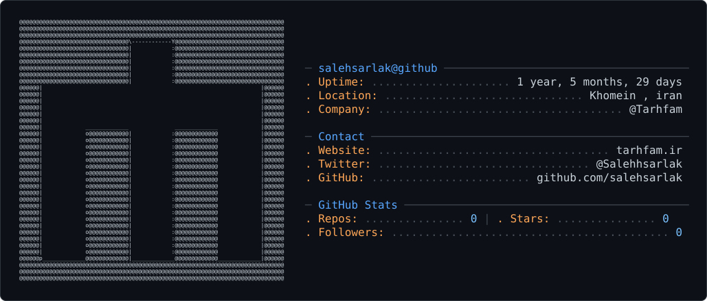

<picture>
  <source media="(prefers-color-scheme: dark)" srcset="dark_mode.svg" />
  <source media="(prefers-color-scheme: light)" srcset="light_mode.svg" />
  
</picture>

 

<h1>
  
</h1>

  

  
  
  
  

---

### 👋 About Me

I'm **Saleh Sarlak** — Web Designer & WordPress Developer, founder of **[Tarhfam](https://tarhfam.ir)**.
I build fast, SEO-driven WordPress websites and design clean, modern, user-focused digital experiences.

- 🎨 UI/UX Design • Responsive Design • Design Systems
- 🛠️ WordPress Specialist — Elementor Pro, JetEngine, WooCommerce
- 📈 Technical SEO & GEO (Generative Engine Optimization)
- 💻 Frontend fundamentals — HTML / CSS / JS / PHP
- 🌱 Currently exploring AI-powered automation & SaaS tooling for Tarhfam

---

### 🛠️ Tech Stack & Tools

  

  

---

### 📊 GitHub Stats

  
  

 

  

---

### 🚀 Featured Work

- **Bookivery (بوکیوری)** — Online bookstore with a seller/representative & city-based ordering system
- **Patak Shoes (پاتک)** — E-commerce store for shoes & bags built on WooCommerce
- **Ressiman (رسیمن)** — Grocery e-commerce platform
- **Aman Med Iran** — Medical tourism website

---

### 📫 Let's Connect

دوست داری روی یه پروژه طراحی یا وردپرس با هم کار کنیم؟ خوشحال می‌شم حرف بزنیم!

  
  

---

### 🐍 Contribution Snake

<!--START_SECTION:waving-snake-->

<!--END_SECTION:waving-snake-->

  

